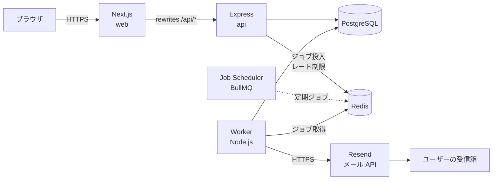

# サブスク管理アプリ（Subscription Manager）

契約中のサブスクリプションを一元管理して毎月の支出をひと目で把握でき、
**更新日が近づくとメールで知らせて解約忘れ・トライアル終了忘れを防ぐ** Web アプリです。

> [!NOTE]
> 個人の開発練習として作っているプロジェクトです。
> 要件定義から運用まで **設計フェーズをすべて文書化** し（[`docs/`](docs/)）、それに沿って実装を進めています。
> 現在の進捗は [ロードマップ](#ロードマップ) を参照してください。


---

## 目次

- [主な機能](#主な機能)
- [設計のポイント](#設計のポイント)
- [システム構成](#システム構成)
- [技術スタック](#技術スタック)
- [リポジトリ構成](#リポジトリ構成)
- [ローカルでの起動](#ローカルでの起動)
- [ロードマップ](#ロードマップ)
- [設計ドキュメント](#設計ドキュメント)

---

## 主な機能

| 分類 | 内容 |
|---|---|
| **サブスク管理** | 登録・一覧（絞り込み・並び替え）・詳細・編集・解約・再開・削除。月単位／年単位の任意の周期（例：3 か月ごと、2 年ごと）に対応 |
| **支出の可視化** | 月額換算・年額換算の合計、サービス別の棒グラフ、月払い／年払いの内訳円グラフ、今後 30 日以内の更新予定 |
| **更新リマインダー** | 更新日の N 日前（既定：7 日前・1 日前）にメール通知。通知タイミング・時刻はユーザー単位／サブスク単位で変更可能。無料トライアルは「課金開始」を強調した文面で送信 |
| **通知の信頼性** | 同じ通知を二度送らない（冪等性）、一時的な失敗は自動リトライ、更新日を過ぎたら次回更新日へ自動繰り上げ、メールからワンクリックで配信停止 |
| **アカウント** | メール＋パスワードでのサインアップ（メール認証あり）、ログイン／ログアウト、パスワードリセット・変更、退会 |

---

## 設計のポイント

このアプリの主役は **「送るべき通知を、送るべき時に、ちょうど 1 回だけ送る」** ことです。
プロセスの停止・ワーカーの多重起動・外部メール API の障害が起こる前提で設計しています。

### 1. アウトボックス型のリマインダー設計

「いつ・何を送るか」は DB の `reminders` テーブルを正とし、ジョブキュー（BullMQ / Redis）は「今すぐ送る」ための実行手段としてのみ使います。

- 5 分ごとの定期スキャンが、送信時刻を迎えたリマインダーを DB から拾ってキューへ投入
- 数か月先の通知を遅延ジョブとして Redis に溜めないため、**Redis のデータが消えても DB から自己修復** できる
- サブスクの編集・解約・タイムゾーン変更のたびに遅延ジョブを探して消す、という不整合の温床を避けられる

👉 詳細：[07. リマインダー・非同期ジョブ設計](docs/07_reminder_jobs.md)、[ADR-006](docs/02_architecture.md#adr-006-リマインダーの実現方式)

### 2. 5 層の冪等性（重複送信の防止）

| 層 | 仕組み | 防ぐもの |
|---|---|---|
| ① DB | `UNIQUE(subscription_id, renewal_date, offset_days)` | 再生成・編集の繰り返しで同じ通知行ができる |
| ② DB | `FOR UPDATE SKIP LOCKED` ＋ `PENDING → QUEUED` の状態遷移 | 複数ワーカーのスキャンが同じ行を拾う |
| ③ キュー | `jobId = reminder-{id}` | 同じリマインダーのジョブが 2 つ入る |
| ④ ワーカー | 処理開始時に送信済みなら即完了 | リトライ・再投入されたジョブの二重処理 |
| ⑤ メール API | `Idempotency-Key: reminder-{id}` | 「送信成功 → DB 更新前にクラッシュ」からのリトライによる再送 |

メール API の冪等キーに保持期間がある点などの **残るリスクも明示的に記録** し、「外部 API 連携における現実的な配信保証」として落とし所を決めています。

### 3. 技術選定を ADR として記録

[`docs/02_architecture.md`](docs/02_architecture.md) に設計判断記録（ADR）を残しています。

- **BullMQ（Redis） vs pg-boss（PostgreSQL）**：pg-boss なら DB 更新とジョブ投入を同一トランザクションにできる一方、BullMQ はエコシステム・ダッシュボード・Redis のレート制限流用に強みがある。BullMQ を採用し、原子性がない弱点はアウトボックス型設計で補う
- **REST vs GraphQL**：リソースが少なく関係も単純なため REST ＋ OpenAPI
- **セッション vs JWT**：ログアウト・パスワード変更時の即時失効を素直に実現するためサーバーサイドセッション
- **同一オリジン化**：Next.js の `rewrites` で API をプロキシし、CORS やサードパーティ Cookie の問題を回避

### 4. 月末・うるう年・タイムゾーンを考慮した日付計算

- 更新日は **前回の更新日ではなく、毎回起算日から計算**（1/31 起算なら 2/28 → 3/31 → 4/30。前回日付に足す方式だと 3/28 → 4/28 とずれていく）
- 日付は「ユーザーのタイムゾーンにおけるローカル日付」、時刻は UTC で保存し、サーバーの TZ に依存しない
- これらは DB・フレームワーク非依存の純粋関数として `packages/shared/domain` に置き、フロントの「次回更新日プレビュー」とサーバーで同じロジックを共有。ユニットテストを最も厚くする

👉 詳細：[03. ドメインルール](docs/03_domain_logic.md)

### 5. セキュリティを意識した認証設計

- パスワードは argon2id でハッシュ化
- セッショントークンは DB に **SHA-256 ハッシュのみ保存**（DB が漏れても Cookie を偽造できない）
- `__Host-` 接頭辞・HttpOnly・Secure・SameSite=Lax の Cookie、アイドル期限 7 日／絶対期限 30 日
- パスワード変更・リセット時のセッション失効、Origin 検証、レート制限、OWASP Top 10 を踏まえた脅威と対策の一覧

👉 詳細：[06. 認証・認可・セキュリティ設計](docs/06_auth_security.md)

---

## システム構成



| コンポーネント | 役割 |
|---|---|
| web | 画面描画（Next.js App Router）。`/api/*` を api へプロキシ |
| api | REST API、認証、入力検証、DB 更新、ジョブ投入 |
| worker | 定期ジョブ（リマインダーのスキャン・更新日の繰り上げ・クリーンアップ）とメール送信 |
| PostgreSQL | 永続データ（正の情報源） |
| Redis | ジョブキュー（BullMQ）、レート制限カウンタ |

API とワーカーを別プロセスに分けることで、メール送信の遅延・失敗が API の応答に影響せず、ワーカーだけを再起動・スケールできます。

---

## 技術スタック

| 分類 | 採用 |
|---|---|
| 言語 | TypeScript（フロント・バック・ワーカーで共通） |
| フロントエンド | Next.js（App Router）、React、Tailwind CSS、shadcn/ui、TanStack Query、React Hook Form、Recharts |
| バックエンド | Node.js 24、Express 5、zod（フロントとスキーマ共有）、OpenAPI 3.1 |
| DB / ORM | PostgreSQL 16、Prisma |
| 非同期処理 | BullMQ ＋ Redis |
| メール | Resend（本番）／ Mailpit（開発）、React Email |
| 認証 | メール＋パスワード、サーバーサイドセッション（Cookie）、argon2id |
| テスト | Vitest、Supertest、Playwright |
| 開発環境 | pnpm workspaces（monorepo）、Docker Compose、GitHub Actions |
| デプロイ（予定） | Render（Web / API / Worker / Postgres / Redis） |

---

## リポジトリ構成

pnpm workspaces による monorepo です。

```
subscription-manager/
├─ apps/
│  ├─ web/                 # フロントエンド（Next.js）
│  └─ server/              # API サーバーとワーカー（エントリーポイントを分ける）
│     ├─ src/
│     │  ├─ api.ts         # API サーバー起動
│     │  ├─ worker.ts      # ワーカー起動
│     │  ├─ routes/        # ルーティング（HTTP 層）
│     │  ├─ services/      # ユースケース（業務ロジック）
│     │  ├─ jobs/          # ジョブ定義・プロセッサ
│     │  ├─ mail/          # メールテンプレート・送信アダプタ
│     │  ├─ lib/           # prisma, redis, logger, config
│     │  └─ middlewares/   # 認証・エラーハンドリング・レート制限
│     ├─ prisma/           # スキーマ・マイグレーション
│     └─ test/
├─ packages/
│  └─ shared/              # web と server で共有
│     ├─ schemas/          # zod スキーマ・API 型・定数
│     └─ domain/           # 純粋関数（更新日計算・金額換算・リマインダー計画）
├─ docs/                   # 設計ドキュメント
├─ docker-compose.yml      # PostgreSQL / Redis / Mailpit
└─ .github/workflows/ci.yml
```

依存の方向は `routes → services → shared/domain`。`domain` は DB やフレームワークに依存しないため、単体でテストできます。

---

## ローカルでの起動

### 必要なもの

- Node.js 24（`.node-version` で指定。fnm などのバージョンマネージャ推奨）
- pnpm 12（`corepack enable pnpm`）
- Docker（DB・Redis・メール確認用。M2 以降で使用）

### 手順

```bash
pnpm install
pnpm dev
```

| URL | 内容 |
|---|---|
| http://localhost:3000 | Web（Next.js） |
| http://localhost:4000/api/v1/ping | API の疎通確認 |

ミドルウェア（PostgreSQL・Redis・Mailpit）は Docker Compose で起動します。

```bash
docker compose up -d
```

| URL / ポート | 内容 |
|---|---|
| `localhost:5432` | PostgreSQL |
| `localhost:6379` | Redis |
| http://localhost:8025 | Mailpit（開発用メールの確認画面） |

Windows 11 での詳しい環境構築手順は [11. 開発環境構築手順](docs/11_setup.md) を参照してください。

---

## 設計ドキュメント

| # | ドキュメント | 内容 |
|---|---|---|
| 0 | [構想メモの穴と決定事項](docs/00_gap_analysis.md) | 初期構想の曖昧な点の洗い出しと、その決定内容 |
| 1 | [要件定義](docs/01_requirements.md) | 機能要件・非機能要件・スコープ外 |
| 2 | [システム構成・技術選定](docs/02_architecture.md) | 全体構成・技術スタック・ADR |
| 3 | [ドメインルール](docs/03_domain_logic.md) | 更新日計算・金額換算・状態遷移 |
| 4 | [データベース設計](docs/04_database.md) | ER 図・テーブル定義・インデックス・Prisma スキーマ |
| 5 | [API 設計](docs/05_api.md) | REST エンドポイント・入出力・エラー形式（RFC 9457） |
| 6 | [認証・認可・セキュリティ](docs/06_auth_security.md) | セッション・ワンタイムトークン・脅威と対策 |
| 7 | [リマインダー・非同期ジョブ](docs/07_reminder_jobs.md) | **中核**：ジョブ設計・冪等性・ワーカー運用 |
| 8 | [画面設計](docs/08_frontend.md) | 画面一覧・画面遷移・可視化 |
| 9 | [開発・テスト・運用](docs/09_operations.md) | テスト戦略・CI/CD・デプロイ・監視 |
| 10 | [実装マイルストーン](docs/10_roadmap.md) | 実装の順序と完了条件 |
| 11 | [開発環境構築手順](docs/11_setup.md) | Windows 11 でのセットアップ |

### スコープ外（v1）

多通貨・為替レート対応、支出予測・カテゴリ分析、ソーシャルログイン・2 要素認証、複数人での共有など。
理由は [00. 構想メモの穴と決定事項](docs/00_gap_analysis.md#e-明示的にスコープ外としたもの) に記載しています。
