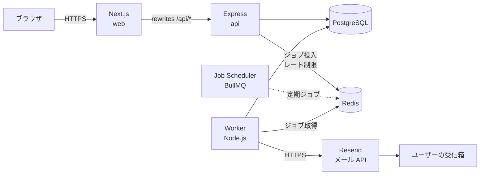

# 02. システム構成・技術選定

## 1. 全体構成



| コンポーネント | 役割 | プロセス |
|---|---|---|
| web | 画面描画（Next.js App Router）。`/api/*` を api へプロキシ | 1 |
| api | REST API、認証、入力検証、DB 更新、ジョブ投入 | 1〜n |
| worker | 定期ジョブ（スキャン・繰り上げ）とメール送信ジョブの処理 | 1〜n |
| PostgreSQL | 永続データ（正の情報源） | マネージド |
| Redis | ジョブキュー（BullMQ）、レート制限カウンタ | マネージド |
| Resend | メール送信 API | 外部 |

### なぜ api と worker を分けるか
- メール送信の遅延・失敗が API の応答時間に影響しない
- worker だけを再起動・スケールできる
- 「非同期処理を主役にする」という構想を構成として明示できる

## 2. リポジトリ構成（pnpm workspaces の monorepo）

```
subscription-manager/
├─ apps/
│  ├─ web/                 # Next.js
│  │  └─ src/app/...
│  └─ server/              # Express API と Worker（エントリーポイントを分ける）
│     ├─ src/
│     │  ├─ api.ts         # API サーバー起動
│     │  ├─ worker.ts      # ワーカー起動
│     │  ├─ routes/        # ルーティング（HTTP 層）
│     │  ├─ services/      # ユースケース（業務ロジック）
│     │  ├─ jobs/          # ジョブ定義・プロセッサ
│     │  ├─ mail/          # メールテンプレート・送信アダプタ
│     │  ├─ lib/           # prisma, redis, logger, config
│     │  └─ middlewares/   # 認証・エラーハンドリング・レート制限
│     ├─ prisma/
│     │  ├─ schema.prisma
│     │  └─ migrations/
│     └─ test/
├─ packages/
│  └─ shared/              # web と server で共有
│     ├─ schemas/          # zod スキーマ・API 型・定数
│     └─ domain/           # 純粋関数（更新日計算・金額換算・リマインダー計画）※DB 非依存
├─ docker-compose.yml      # postgres, redis, mailpit
└─ .github/workflows/ci.yml
```

レイヤーの依存方向：`routes → services → shared/domain`、`services → lib(prisma)`。
`domain` は DB・フレームワークに依存しない純粋関数にして、ユニットテストしやすくする。
共有パッケージに置くことで、フロントの「次回更新日プレビュー」でも同じ計算ロジックを使える。

## 3. 技術スタック詳細

| 分類 | 採用 | 理由 |
|---|---|---|
| ランタイム | Node.js 24 LTS | fnm でバージョン固定（[11_setup.md](11_setup.md)） |
| パッケージ管理 | pnpm（workspaces） | monorepo で共有パッケージを扱いやすい |
| フロント | Next.js（App Router）、React | 構想どおり |
| UI | Tailwind CSS ＋ shadcn/ui | 素早く整った UI を作る |
| データ取得 | TanStack Query | キャッシュ・再取得・ミューテーション後の無効化 |
| フォーム | React Hook Form ＋ zod | 共有スキーマでバリデーションを一元化 |
| グラフ | Recharts | React と相性が良く棒・円グラフが簡単 |
| API | Express 5 | 構想どおり。async エラーを自動で next に渡せる |
| バリデーション | zod | フロントと共有 |
| API 仕様 | OpenAPI 3.1（zod から生成：`@asteasolutions/zod-to-openapi`） | 仕様と実装の乖離を防ぐ |
| ORM | Prisma | 型安全・マイグレーション管理 |
| DB | PostgreSQL 16 | |
| キュー | BullMQ（Redis） | ADR-002 |
| パスワードハッシュ | argon2id（`@node-rs/argon2`） | OWASP 推奨 |
| 日付計算 | date-fns ＋ @date-fns/tz | 月末丸め・タイムゾーン変換 |
| メール | Resend（本番）、Nodemailer→Mailpit（開発） | 送信アダプタを差し替え可能にする |
| メールテンプレート | React Email | JSX でテンプレート、HTML とテキスト版を生成 |
| ログ | pino ＋ pino-http | JSON 構造化ログ |
| セキュリティヘッダ | helmet | |
| テスト | Vitest、Supertest、Playwright（E2E 最小限） | |
| Lint/Format | ESLint ＋ Prettier（または Biome） | |

---

## ADR（設計判断記録）

### ADR-001: API 方式（REST vs GraphQL）

- **決定**：REST（JSON）＋ OpenAPI
- **理由**
  - リソースが「ユーザー」「サブスク」「リマインダー」と少なく、関係も単純。GraphQL の柔軟なクエリの恩恵が小さい
  - HTTP ステータスコード・キャッシュ・冪等性（PUT/DELETE）など HTTP の意味論を学ぶ練習になる
  - 今回の主役は非同期処理であり、API 層に学習コストを割きすぎない
- **却下案**：GraphQL（N+1 対策・認可の粒度設計などの追加論点が増える）

### ADR-002: ジョブキュー

比較対象：**BullMQ（Redis）** と **pg-boss（PostgreSQL）**

| 観点 | BullMQ + Redis | pg-boss（PostgreSQL のみ） |
|---|---|---|
| 追加インフラ | Redis が必要 | 不要（既存の Postgres を使う） |
| 定期実行 | Job Scheduler（`upsertJobScheduler`、cron 式・間隔指定） | `boss.schedule()`（cron 式） |
| 遅延・リトライ | 遅延、指数バックオフ、最大試行回数 | 同等（`retryLimit`、`retryBackoff`） |
| 重複排除 | `jobId` 指定で同一 ID のジョブは追加されない | `singletonKey` |
| **DB 更新との原子性** | **不可**（Postgres と Redis は別トランザクション）→ 「DB 更新後にジョブ投入」の間でクラッシュすると取りこぼす | **可能**（同一トランザクションでジョブ挿入できる）→ トランザクショナルアウトボックスが自然に実現 |
| スループット | 非常に高い | DB 負荷に依存（本アプリの規模では十分） |
| 可視化 | Bull Board 等のダッシュボード | 公式ダッシュボードは限定的 |
| 学習・アピール | 業界での採用例が多く、Redis の知識も得られる | 「Postgres だけでキュー」は設計の理解を示せる |
| レート制限用途 | Redis をそのまま流用できる | 別途必要（DB or メモリ） |

- **決定**：**BullMQ を採用**
- **理由**
  - Node.js における事実上の標準で、リトライ・スケジューラ・ダッシュボードが揃っている
  - Redis をレート制限にも流用でき、インフラ追加の価値がある
- **BullMQ の弱点（原子性がない）への対策**
  - 「送るべき通知」は **DB の `reminders` テーブルを正** とし、キューは単なる実行手段として扱う（アウトボックス型）
  - 定期スキャンが DB から未処理分を拾い直すため、投入漏れ・Redis データ消失があっても次回スキャンで自己修復する
  - 詳細は [07_reminder_jobs.md](07_reminder_jobs.md)
- **pg-boss を採用した場合の差分**（参考）
  - スキャンジョブ内で `reminders` 更新とジョブ挿入を同一トランザクションにでき、`QUEUED` 状態の取り残し回復処理が不要になる
  - Redis が不要になり、レート制限は Postgres テーブル or `rate-limiter-flexible` の Postgres ストアで代替する

### ADR-003: 認証方式

- **決定**：サーバーサイドセッション（DB 保存）＋ HttpOnly Cookie。詳細は [06](06_auth_security.md)
- **却下案**：JWT（ログアウト・パスワード変更時の即時失効にブラックリストが必要になり、結局サーバー側状態を持つことになる）

### ADR-004: フロントと API のオリジン

- **決定**：Next.js の `rewrites` で `/api/:path*` を Express に転送し、ブラウザからは **同一オリジン** に見せる
- **理由**：CORS 設定・`SameSite=None` Cookie・サードパーティ Cookie 制限の問題を回避できる
- **トレードオフ**：web を経由する分わずかにレイテンシが増える（許容）

### ADR-005: メール送信サービス

- **決定**：Resend
- **理由**：Node SDK が簡潔、無料枠あり、**`Idempotency-Key` ヘッダーで重複送信を防げる**（冪等性設計の第 3 層として使える）
- **代替**：Amazon SES、SendGrid、Postmark。送信は `MailSender` インターフェースで抽象化し差し替え可能にする

```ts
// メール送信アダプタのインターフェース
export interface MailSender {
  send(input: {
    to: string;
    subject: string;
    html: string;
    text: string;
    headers?: Record<string, string>;
    idempotencyKey?: string; // 重複送信防止キー
  }): Promise<{ messageId: string }>;
}
```

### ADR-006: リマインダーの実現方式

- **決定**：リマインダーを DB に実体化し、定期スキャンでキュー投入する（アウトボックス型）
- **却下案**：サブスク登録時に「N 日後に実行される遅延ジョブ」を直接キューに積む
  - 編集・削除・解約・タイムゾーン変更のたびに既存の遅延ジョブを探して消す必要があり不整合が起きやすい
  - 数か月〜1 年先のジョブを Redis に長期間保持することになり、Redis 障害時に失われる
- 詳細は [07_reminder_jobs.md](07_reminder_jobs.md)
