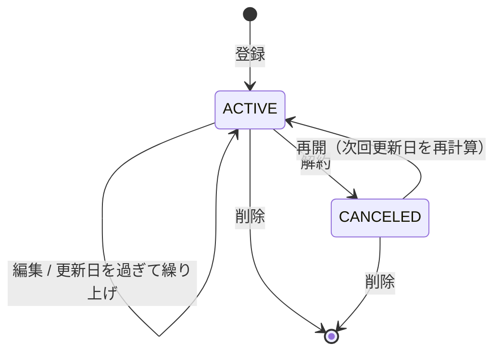

# 03. ドメインルール

DB や HTTP に依存しない業務ルールを定義する。実装は `packages/shared/domain/` の純粋関数とし（フロントとサーバーで共有）、
ユニットテストを最も厚くする箇所。

## 1. 日付・時刻の扱い

| 種類 | 型 | 意味 |
|---|---|---|
| 起算日・次回更新日・通知対象日 | `DATE`（時刻なし） | **ユーザーのタイムゾーンにおけるローカル日付** |
| 通知予定時刻・送信時刻・作成日時 | `timestamptz` | UTC で保存し、表示時に変換 |

- 「今日」は常に **ユーザーのタイムゾーンで** 求める（サーバーの TZ に依存しない）
- サーバープロセスは `TZ=UTC` で動かす
- API では日付を `YYYY-MM-DD` 文字列、日時を ISO 8601（UTC, `Z` 付き）でやり取りする

## 2. 請求サイクル

```
interval_unit  : MONTH | YEAR
interval_count : MONTH なら 1〜12、YEAR なら 1〜5
```

例：月額＝(MONTH,1)、3 か月ごと＝(MONTH,3)、半年＝(MONTH,6)、年額＝(YEAR,1)

1 サイクルの月数：`cycleMonths = unit === 'YEAR' ? count * 12 : count`

## 3. 更新日の計算

### 3.1 ルール

- **起算日（`billing_anchor_date`）** を正とし、k 回目の更新日を次で求める

```
renewalDate(k) = addMonths(anchor, k * cycleMonths)   // k = 0, 1, 2, ...
```

- `addMonths` は「存在しない日は月末に丸める」（date-fns の挙動）
- **前回の更新日に足すのではなく、毎回起算日から計算する** ことで月末のずれを防ぐ

| 起算日 | サイクル | k=1 | k=2 | k=3 |
|---|---|---|---|---|
| 2026-01-31 | 1 か月 | 2026-02-28 | 2026-03-31 | 2026-04-30 |
| 2026-01-30 | 1 か月 | 2026-02-28 | 2026-03-30 | 2026-04-30 |
| 2024-02-29 | 1 年 | 2025-02-28 | 2026-02-28 | 2027-02-28 |
| 2026-03-15 | 3 か月 | 2026-06-15 | 2026-09-15 | 2026-12-15 |

> 参考：前回日付に足す方式だと 1/31 → 2/28 → 3/28 → 4/28 とずれていく（これが穴 A2）

### 3.2 次回更新日

```ts
// today（ユーザーのローカル日付）以降で最初の更新日を返す
export function nextRenewalDate(anchor: LocalDate, cycleMonths: number, today: LocalDate): LocalDate {
  if (anchor >= today) return anchor;                 // 起算日が未来ならそれが次回
  const monthsDiff = differenceInCalendarMonths(today, anchor);
  let k = Math.floor(monthsDiff / cycleMonths);
  let d = addMonths(anchor, k * cycleMonths);
  while (d < today) {                                  // 丸めの影響で1サイクル足りない場合を補正
    k += 1;
    d = addMonths(anchor, k * cycleMonths);
  }
  return d;
}
```

- **更新日当日は「まだ次回更新日」扱い**（当日 0 時に繰り上げない）。更新日の翌日になったら次サイクルへ
- 登録・編集時、および繰り上げジョブ・再開（reactivate）時にこの関数で `next_renewal_date` を再計算する

### 3.3 無料トライアル

- `is_trial = true` のとき、起算日＝**トライアル終了日（＝初回課金日）** として登録してもらう
- 次回更新日が起算日を過ぎて繰り上がった時点で `is_trial = false` に自動更新
- トライアル中は集計（月額換算合計など）に **含める**（課金予定額の把握が目的のため）が、一覧・ダッシュボードでは「トライアル中」バッジを表示

## 4. 金額

- 円の **整数** で保持（0〜10,000,000）
- 月額換算・年額換算（ダッシュボード用）

```
monthlyEquivalent = amount / cycleMonths          // 例：年額 12,000 → 1,000、年額 10,000 → 833.33...
yearlyEquivalent  = amount * 12 / cycleMonths
```

- **丸めは合計を出した後に 1 回だけ**（四捨五入）。個別の行表示も四捨五入
  - 個別値を丸めてから合計すると、表示上の合計と各行の和が 1 円ずれることがある → 許容し、UI に「※月額換算は概算」と注記
- 合計は契約中（`ACTIVE`）のみが対象

## 5. ステータス遷移



| ステータス | 集計対象 | リマインダー | 繰り上げ |
|---|---|---|---|
| ACTIVE | ○ | ○（通知 ON の場合） | ○ |
| CANCELED | × | ×（未送信分は SKIPPED） | × |

- 解約時は `canceled_at` を記録。`next_renewal_date` は最後の値のまま残す（「いつまで使えたか」の参考）
- 「解約予約（期間終了までは使える）」は区別しない（v1 の割り切り）。期間終了日をメモしたい場合はメモ欄で対応

## 6. リマインダーのオフセット

- 値の範囲：0〜30（日前）。0 は更新日当日
- 個数：1〜3 個。重複不可。保存時に降順ソート
- 決定順序：サブスクの `reminder_offsets`（空配列でなければ）→ ユーザーの `default_reminder_offsets`
- 通知予定時刻：

```
scheduledAt = (renewalDate - offset日) の notify_hour:00 を、ユーザーの timezone で解釈し UTC に変換
```

例：timezone=Asia/Tokyo、notify_hour=9、renewal=2026-10-20、offset=7
→ 2026-10-13 09:00 JST → `2026-10-13T00:00:00Z`

> サマータイムのある TZ で存在しない時刻になる場合は @date-fns/tz の解決（後ろへずらす）に従う
