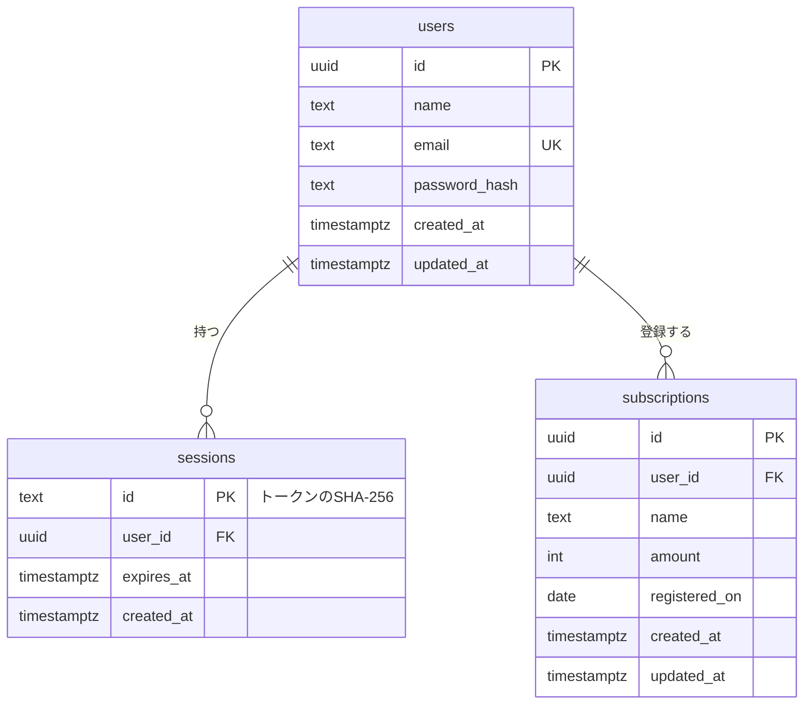

# 04. データベース設計

- DBMS：PostgreSQL 16
- ORM：Prisma
- 命名：テーブル・カラムは snake_case（Prisma 側は camelCase ＋ `@map`）
- 主キー：UUID。URL に出るため連番は使わない（推測されにくくする）
- 日時：`timestamptz`（UTC）、日付：`date`

## 0. 設計方針

必須機能だけを満たす最小構成にする。

| 必須機能 | 必要なデータ |
|---|---|
| ユーザー登録 | 名前、メールアドレス |
| ログイン | パスワード（ハッシュ）、ログイン状態（セッション） |
| サブスク管理 | 名前、金額、登録日 |

## 1. ER 図



## 2. テーブル定義

### 2.1 users

| カラム | 型 | NULL | 既定値 | 制約・説明 |
|---|---|---|---|---|
| id | uuid | × | uuid() | PK |
| name | text | × | | 1〜50 文字 |
| email | text | × | | UNIQUE。**小文字に正規化してから保存** |
| password_hash | text | × | | argon2id のハッシュ。パスワード本体は保存しない |
| created_at | timestamptz | × | now() | |
| updated_at | timestamptz | × | now() | Prisma `@updatedAt` |

### 2.2 sessions

ログイン状態を保持する。

| カラム | 型 | NULL | 説明 |
|---|---|---|---|
| id | text | × | PK。**Cookie に入れるトークンの SHA-256 ハッシュ**（DB 漏えい時にセッションを奪われないため） |
| user_id | uuid | × | FK → users.id ON DELETE CASCADE |
| expires_at | timestamptz | × | 有効期限（作成から 7 日） |
| created_at | timestamptz | × | |

インデックス：`(user_id)`

### 2.3 subscriptions

| カラム | 型 | NULL | 既定値 | 制約・説明 |
|---|---|---|---|---|
| id | uuid | × | uuid() | PK |
| user_id | uuid | × | | FK → users.id ON DELETE CASCADE |
| name | text | × | | 1〜100 文字 |
| amount | integer | × | | 金額（円）。0〜10,000,000 |
| registered_on | date | ○ | | サブスクに登録した日（ユーザーが入力、任意。NULL＝未入力） |
| created_at | timestamptz | × | now() | |
| updated_at | timestamptz | × | now() | |

インデックス：`(user_id)`

## 3. Prisma スキーマ

```prisma
// Prisma 7 系の書き方。接続 URL は prisma.config.ts に書く（docs/11_setup.md §4.3）
generator client {
  provider = "prisma-client"
  output   = "../src/generated/prisma"
}

datasource db {
  provider = "postgresql"
}

model User {
  id           String   @id @default(uuid()) @db.Uuid
  name         String
  email        String   @unique
  passwordHash String   @map("password_hash")
  createdAt    DateTime @default(now()) @map("created_at") @db.Timestamptz
  updatedAt    DateTime @updatedAt @map("updated_at") @db.Timestamptz

  sessions      Session[]
  subscriptions Subscription[]

  @@map("users")
}

model Session {
  id        String   @id // トークンのSHA-256
  userId    String   @map("user_id") @db.Uuid
  expiresAt DateTime @map("expires_at") @db.Timestamptz
  createdAt DateTime @default(now()) @map("created_at") @db.Timestamptz

  user User @relation(fields: [userId], references: [id], onDelete: Cascade)

  @@index([userId])
  @@map("sessions")
}

model Subscription {
  id           String   @id @default(uuid()) @db.Uuid
  userId       String   @map("user_id") @db.Uuid
  name         String
  amount       Int
  registeredOn DateTime? @map("registered_on") @db.Date
  createdAt    DateTime @default(now()) @map("created_at") @db.Timestamptz
  updatedAt    DateTime @updatedAt @map("updated_at") @db.Timestamptz

  user User @relation(fields: [userId], references: [id], onDelete: Cascade)

  @@index([userId])
  @@map("subscriptions")
}
```

### 注意

- 文字数・金額の範囲チェックは API 側のバリデーションで行う
- `@db.Date` は JS の Date（UTC 0 時）として扱われるため、アプリでは `YYYY-MM-DD` 文字列に変換して扱う

## 4. データ削除

| データ | 方針 |
|---|---|
| 期限切れセッション | ログイン時などに削除（任意） |
| 退会ユーザー | 物理削除（CASCADE で全関連データ削除） |
| サブスク削除 | 物理削除 |
