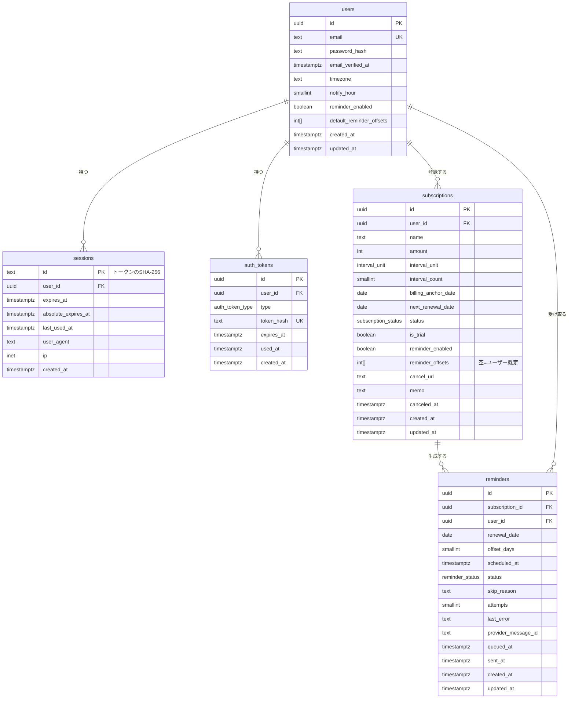

# 04. データベース設計

- DBMS：PostgreSQL 16
- ORM：Prisma
- 命名：テーブル・カラムは snake_case（Prisma 側は camelCase ＋ `@map`）
- 主キー：UUID（`gen_random_uuid()`）。URL に出るため連番は使わない（推測されにくくする）
- 日時：`timestamptz`（UTC）、日付：`date`（ユーザーのローカル日付）

## 1. ER 図



## 2. 列挙型

| 型 | 値 |
|---|---|
| `interval_unit` | `MONTH`, `YEAR` |
| `subscription_status` | `ACTIVE`, `CANCELED` |
| `auth_token_type` | `EMAIL_VERIFICATION`, `PASSWORD_RESET` |
| `reminder_status` | `PENDING`, `QUEUED`, `SENT`, `SKIPPED`, `FAILED` |

`reminders.skip_reason` の値（text）：`EXPIRED`（更新日を過ぎた）、`SUBSCRIPTION_CANCELED`、`REMINDER_DISABLED`、`EMAIL_UNVERIFIED`、`RENEWAL_CHANGED`

## 3. テーブル定義

### 3.1 users

| カラム | 型 | NULL | 既定値 | 制約・説明 |
|---|---|---|---|---|
| id | uuid | × | gen_random_uuid() | PK |
| email | text | × | | UNIQUE。**小文字に正規化してから保存** |
| password_hash | text | × | | argon2id の PHC 文字列 |
| email_verified_at | timestamptz | ○ | | NULL＝未認証 |
| timezone | text | × | 'Asia/Tokyo' | IANA TZ 名。アプリ側で `Intl.supportedValuesOf('timeZone')` で検証 |
| notify_hour | smallint | × | 9 | CHECK 0〜23 |
| reminder_enabled | boolean | × | true | アカウント全体の通知 ON/OFF |
| default_reminder_offsets | integer[] | × | '{7,1}' | 0〜30、1〜3 個（アプリ側で検証） |
| created_at | timestamptz | × | now() | |
| updated_at | timestamptz | × | now() | Prisma `@updatedAt` |

### 3.2 sessions

| カラム | 型 | NULL | 説明 |
|---|---|---|---|
| id | text | × | PK。**Cookie に入れるトークンの SHA-256 ハッシュ**（DB 漏えい時にセッションを奪われないため） |
| user_id | uuid | × | FK → users.id ON DELETE CASCADE |
| expires_at | timestamptz | × | アイドル期限（最終利用から 7 日、利用時に延長） |
| absolute_expires_at | timestamptz | × | 絶対期限（作成から 30 日、延長しない） |
| last_used_at | timestamptz | × | 延長処理の間引きに使う（1 時間に 1 回だけ更新） |
| user_agent | text | ○ | 参考情報 |
| ip | inet | ○ | 参考情報 |
| created_at | timestamptz | × | |

インデックス：`(user_id)`、`(expires_at)`（期限切れ削除ジョブ用）

### 3.3 auth_tokens

メール認証・パスワードリセット用のワンタイムトークン。

| カラム | 型 | NULL | 説明 |
|---|---|---|---|
| id | uuid | × | PK |
| user_id | uuid | × | FK → users.id ON DELETE CASCADE |
| type | auth_token_type | × | |
| token_hash | text | × | UNIQUE。トークン本体の SHA-256。本体は保存しない |
| expires_at | timestamptz | × | 認証：24 時間、リセット：1 時間 |
| used_at | timestamptz | ○ | 使用済みなら値あり（再利用不可） |
| created_at | timestamptz | × | |

インデックス：`(user_id, type)`
新しいトークン発行時は、同じ `user_id`・`type` の未使用トークンを無効化（削除）する。

### 3.4 subscriptions

| カラム | 型 | NULL | 既定値 | 制約・説明 |
|---|---|---|---|---|
| id | uuid | × | gen_random_uuid() | PK |
| user_id | uuid | × | | FK → users.id ON DELETE CASCADE |
| name | text | × | | 1〜100 文字 |
| amount | integer | × | | CHECK 0〜10,000,000（円） |
| interval_unit | interval_unit | × | 'MONTH' | |
| interval_count | smallint | × | 1 | CHECK (unit=MONTH AND 1〜12) OR (unit=YEAR AND 1〜5) |
| billing_anchor_date | date | × | | 起算日（初回請求日） |
| next_renewal_date | date | × | | 派生値（[03](03_domain_logic.md) の計算結果を保存） |
| status | subscription_status | × | 'ACTIVE' | |
| is_trial | boolean | × | false | |
| reminder_enabled | boolean | × | true | |
| reminder_offsets | integer[] | × | '{}' | **空配列＝ユーザー既定を使用**（Prisma のスカラー配列は NULL 不可のため） |
| cancel_url | text | ○ | | http/https のみ、2048 文字以内 |
| memo | text | ○ | | 1000 文字以内 |
| canceled_at | timestamptz | ○ | | |
| created_at | timestamptz | × | now() | |
| updated_at | timestamptz | × | now() | |

インデックス：
- `(user_id, status, next_renewal_date)`：一覧・ダッシュボード
- `(status, next_renewal_date)`：繰り上げジョブのスキャン

### 3.5 reminders

**送るべき通知 1 通 = 1 行**。通知のアウトボックス兼送信履歴。

| カラム | 型 | NULL | 説明 |
|---|---|---|---|
| id | uuid | × | PK。キューの jobId とメール API の Idempotency-Key にも使う |
| subscription_id | uuid | × | FK → subscriptions.id ON DELETE CASCADE |
| user_id | uuid | × | FK → users.id ON DELETE CASCADE（ユーザー単位の再生成用に非正規化） |
| renewal_date | date | × | どの更新日に対する通知か |
| offset_days | smallint | × | 何日前の通知か |
| scheduled_at | timestamptz | × | 送信予定時刻（UTC） |
| status | reminder_status | × | 既定 'PENDING' |
| skip_reason | text | ○ | SKIPPED の理由 |
| attempts | smallint | × | 既定 0。送信試行回数 |
| last_error | text | ○ | 直近のエラー内容（先頭 1000 文字） |
| provider_message_id | text | ○ | Resend のメッセージ ID |
| queued_at | timestamptz | ○ | キュー投入時刻 |
| sent_at | timestamptz | ○ | 送信完了時刻 |
| created_at / updated_at | timestamptz | × | |

制約・インデックス：
- **UNIQUE `(subscription_id, renewal_date, offset_days)`** ← 冪等性の第 1 層。同じ更新日・同じオフセットの通知は 1 行しか存在できない
- `(status, scheduled_at)`：スキャンジョブ用（部分インデックス `WHERE status IN ('PENDING','QUEUED')` を推奨）
- `(subscription_id, created_at DESC)`：通知履歴表示用

## 4. Prisma スキーマ

```prisma
// Prisma 7 系の書き方。接続 URL は prisma.config.ts に書く（docs/11_setup.md §4.3）
generator client {
  provider = "prisma-client"
  output   = "../src/generated/prisma"
}

datasource db {
  provider = "postgresql"
}

enum IntervalUnit {
  MONTH
  YEAR
}

enum SubscriptionStatus {
  ACTIVE
  CANCELED
}

enum AuthTokenType {
  EMAIL_VERIFICATION
  PASSWORD_RESET
}

enum ReminderStatus {
  PENDING
  QUEUED
  SENT
  SKIPPED
  FAILED
}

model User {
  id                     String    @id @default(uuid()) @db.Uuid
  email                  String    @unique
  passwordHash           String    @map("password_hash")
  emailVerifiedAt        DateTime? @map("email_verified_at") @db.Timestamptz
  timezone               String    @default("Asia/Tokyo")
  notifyHour             Int       @default(9) @map("notify_hour") @db.SmallInt
  reminderEnabled        Boolean   @default(true) @map("reminder_enabled")
  defaultReminderOffsets Int[]     @default([7, 1]) @map("default_reminder_offsets")
  createdAt              DateTime  @default(now()) @map("created_at") @db.Timestamptz
  updatedAt              DateTime  @updatedAt @map("updated_at") @db.Timestamptz

  sessions      Session[]
  authTokens    AuthToken[]
  subscriptions Subscription[]
  reminders     Reminder[]

  @@map("users")
}

model Session {
  id                String   @id // トークンのSHA-256
  userId            String   @map("user_id") @db.Uuid
  expiresAt         DateTime @map("expires_at") @db.Timestamptz
  absoluteExpiresAt DateTime @map("absolute_expires_at") @db.Timestamptz
  lastUsedAt        DateTime @default(now()) @map("last_used_at") @db.Timestamptz
  userAgent         String?  @map("user_agent")
  ip                String?  @db.Inet
  createdAt         DateTime @default(now()) @map("created_at") @db.Timestamptz

  user User @relation(fields: [userId], references: [id], onDelete: Cascade)

  @@index([userId])
  @@index([expiresAt])
  @@map("sessions")
}

model AuthToken {
  id        String        @id @default(uuid()) @db.Uuid
  userId    String        @map("user_id") @db.Uuid
  type      AuthTokenType
  tokenHash String        @unique @map("token_hash")
  expiresAt DateTime      @map("expires_at") @db.Timestamptz
  usedAt    DateTime?     @map("used_at") @db.Timestamptz
  createdAt DateTime      @default(now()) @map("created_at") @db.Timestamptz

  user User @relation(fields: [userId], references: [id], onDelete: Cascade)

  @@index([userId, type])
  @@map("auth_tokens")
}

model Subscription {
  id                String             @id @default(uuid()) @db.Uuid
  userId            String             @map("user_id") @db.Uuid
  name              String
  amount            Int
  intervalUnit      IntervalUnit       @default(MONTH) @map("interval_unit")
  intervalCount     Int                @default(1) @map("interval_count") @db.SmallInt
  billingAnchorDate DateTime           @map("billing_anchor_date") @db.Date
  nextRenewalDate   DateTime           @map("next_renewal_date") @db.Date
  status            SubscriptionStatus @default(ACTIVE)
  isTrial           Boolean            @default(false) @map("is_trial")
  reminderEnabled   Boolean            @default(true) @map("reminder_enabled")
  reminderOffsets   Int[]              @default([]) @map("reminder_offsets") // 空配列＝ユーザー既定（※下記注意）
  cancelUrl         String?            @map("cancel_url")
  memo              String?
  canceledAt        DateTime?          @map("canceled_at") @db.Timestamptz
  createdAt         DateTime           @default(now()) @map("created_at") @db.Timestamptz
  updatedAt         DateTime           @updatedAt @map("updated_at") @db.Timestamptz

  user      User       @relation(fields: [userId], references: [id], onDelete: Cascade)
  reminders Reminder[]

  @@index([userId, status, nextRenewalDate])
  @@index([status, nextRenewalDate])
  @@map("subscriptions")
}

model Reminder {
  id                String         @id @default(uuid()) @db.Uuid
  subscriptionId    String         @map("subscription_id") @db.Uuid
  userId            String         @map("user_id") @db.Uuid
  renewalDate       DateTime       @map("renewal_date") @db.Date
  offsetDays        Int            @map("offset_days") @db.SmallInt
  scheduledAt       DateTime       @map("scheduled_at") @db.Timestamptz
  status            ReminderStatus @default(PENDING)
  skipReason        String?        @map("skip_reason")
  attempts          Int            @default(0) @db.SmallInt
  lastError         String?        @map("last_error")
  providerMessageId String?        @map("provider_message_id")
  queuedAt          DateTime?      @map("queued_at") @db.Timestamptz
  sentAt            DateTime?      @map("sent_at") @db.Timestamptz
  createdAt         DateTime       @default(now()) @map("created_at") @db.Timestamptz
  updatedAt         DateTime       @updatedAt @map("updated_at") @db.Timestamptz

  subscription Subscription @relation(fields: [subscriptionId], references: [id], onDelete: Cascade)
  user         User         @relation(fields: [userId], references: [id], onDelete: Cascade)

  @@unique([subscriptionId, renewalDate, offsetDays])
  @@index([status, scheduledAt])
  @@index([subscriptionId, createdAt(sort: Desc)])
  @@map("reminders")
}
```

### Prisma の制約上の注意

| 項目 | 対応 |
|---|---|
| スカラー配列は NULL 不可（Prisma の仕様） | `reminder_offsets` は **空配列 = ユーザー既定を使う** と定義する。API では `null` として表現し、境界で変換する |
| CHECK 制約は schema.prisma で書けない | `prisma migrate dev --create-only` で生成した SQL に `ALTER TABLE ... ADD CONSTRAINT ... CHECK (...)` を手で追記する |
| 部分インデックス | 同上、マイグレーション SQL に手書きで追加 |
| `@db.Date` は JS の Date（UTC 0 時）として扱われる | `domain` 層では `YYYY-MM-DD` 文字列（`LocalDate` 型）に変換して扱い、TZ による日付ずれを防ぐ |
| `FOR UPDATE SKIP LOCKED` | Prisma Client では書けないため `prisma.$queryRaw` を使う（[07](07_reminder_jobs.md)） |

追記する CHECK 制約の例：

```sql
ALTER TABLE subscriptions
  ADD CONSTRAINT subscriptions_amount_range CHECK (amount BETWEEN 0 AND 10000000),
  ADD CONSTRAINT subscriptions_name_length CHECK (char_length(name) BETWEEN 1 AND 100),
  ADD CONSTRAINT subscriptions_interval_range CHECK (
    (interval_unit = 'MONTH' AND interval_count BETWEEN 1 AND 12) OR
    (interval_unit = 'YEAR'  AND interval_count BETWEEN 1 AND 5)
  );

ALTER TABLE users
  ADD CONSTRAINT users_notify_hour_range CHECK (notify_hour BETWEEN 0 AND 23);

ALTER TABLE reminders
  ADD CONSTRAINT reminders_offset_range CHECK (offset_days BETWEEN 0 AND 30);

CREATE INDEX reminders_due_idx ON reminders (scheduled_at)
  WHERE status IN ('PENDING', 'QUEUED');
```

## 5. データ保持・削除

| データ | 保持方針 |
|---|---|
| 期限切れセッション | 日次ジョブで削除 |
| 使用済み・期限切れ auth_tokens | 日次ジョブで削除（7 日経過後） |
| reminders（SENT / SKIPPED / FAILED） | 1 年経過後に日次ジョブで削除 |
| 退会ユーザー | 即時物理削除（CASCADE で全関連データ削除） |
| サブスク削除 | 物理削除（CASCADE で reminders も削除） |
