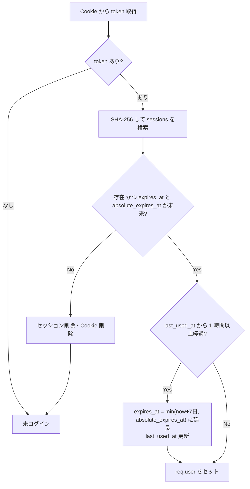

# 06. 認証・認可・セキュリティ設計

## 1. 方針

- 認証は **メールアドレス＋パスワード**、状態は **サーバーサイドセッション（DB 保存）**
- 暗号処理は自作しない。ハッシュは `@node-rs/argon2`、乱数は `crypto.randomBytes`、比較は `crypto.timingSafeEqual`
- セッション管理は Lucia 作者による実装ガイド（The Copenhagen Book）の方式に沿って自前実装する
  - 既製ライブラリ（`express-session`）でも可。学習目的のため仕組みが見える自前実装を選ぶ
- 参照基準：OWASP ASVS / Cheat Sheet Series、NIST SP 800-63B（パスワードポリシー）

## 2. パスワード

| 項目 | 仕様 |
|---|---|
| 長さ | 8〜128 文字（NIST 推奨：最小 8、最大は 64 以上を許容） |
| 文字種の強制 | **しない**（記号必須などは NIST 非推奨） |
| 禁止 | メールアドレスと同一、よくあるパスワード上位 10,000 件（リストを同梱） |
| ハッシュ | argon2id（memoryCost 19456 KiB, timeCost 2, parallelism 1：OWASP 推奨の最小値） |
| 保存 | PHC 形式文字列（パラメータとソルトを含む）→ 将来のパラメータ変更時はログイン成功時に再ハッシュ |
| 表示 | 入力欄に「表示」トグル。強度メーター（zxcvbn-ts）はフロントの補助表示のみ |

## 3. セッション

### 3.1 発行

```
token     = base64url(randomBytes(32))       // Cookie に入れる値
sessionId = hex(SHA-256(token))              // DB の主キー
```

- ログイン成功時に新規発行（**セッション固定攻撃対策：ログイン前の ID を引き継がない**）
- DB には `sessionId` のみ保存（DB が漏れても Cookie を偽造できない）

### 3.2 Cookie

```
Set-Cookie: __Host-sid=<token>; Path=/; HttpOnly; Secure; SameSite=Lax; Max-Age=2592000
```

| 属性 | 理由 |
|---|---|
| `__Host-` 接頭辞 | Secure・Path=/・Domain 無しを強制し、サブドメインからの上書きを防ぐ |
| HttpOnly | XSS で JS から盗まれない |
| Secure | HTTPS のみ（開発環境 `localhost` はブラウザが例外扱い） |
| SameSite=Lax | 他サイトからの POST に Cookie が付かない（CSRF の主対策） |

### 3.3 検証（毎リクエスト）



| 期限 | 値 |
|---|---|
| アイドル期限 | 7 日（利用で延長） |
| 絶対期限 | 30 日（延長されない。期限後は再ログイン） |

### 3.4 失効させるタイミング

| イベント | 失効範囲 |
|---|---|
| ログアウト | 当該セッション |
| パスワード変更 | 当該以外の全セッション（当該は ID 再発行） |
| パスワードリセット | 全セッション |
| 退会 | 全セッション（CASCADE） |

## 4. ワンタイムトークン（メール認証・パスワードリセット）

| 項目 | メール認証 | パスワードリセット |
|---|---|---|
| 生成 | `base64url(randomBytes(32))` | 同左 |
| 保存 | SHA-256 ハッシュのみ（`auth_tokens.token_hash`） | 同左 |
| 有効期限 | 24 時間 | 1 時間 |
| 使用回数 | 1 回 | 1 回 |
| 再発行時 | 同種の未使用トークンを削除 | 同左 |
| リンク | `https://{APP_URL}/verify-email#token=...` | `https://{APP_URL}/reset-password#token=...` |

- トークンを **URL フラグメント（`#`）** に入れる：サーバーのアクセスログ・Referer に残らない。画面の JS が読み取って API に POST する
- メールのリンクを開いただけで認証完了にしない（メールセキュリティ製品のリンク事前スキャンで誤って消費されるのを防ぐため、画面上のボタン押下で POST）

## 5. 認可

- ロールは「本人」のみ（管理者ロールなし）
- **すべてのリソース取得・更新で `user_id = req.user.id` を条件に含める**（IDOR 対策）

```ts
// ✕ ダメな例：ID だけで取得してから所有者チェック（チェック漏れの温床）
// ○ 良い例：所有者条件込みで取得するリポジトリ関数だけを用意する
const sub = await prisma.subscription.findFirst({
  where: { id, userId: req.user.id },
});
if (!sub) throw new NotFoundError(); // 他人のリソースでも 404
```

- 認証必須ルートは `requireAuth` ミドルウェアをルーター単位で適用（個別付け忘れを防ぐ）
- 認可のテスト：「ユーザー A のセッションで B のサブスクを GET/PATCH/DELETE → 404」を全エンドポイントで自動テスト

## 6. 脅威と対策一覧

| 脅威 | 対策 |
|---|---|
| SQL インジェクション | Prisma のパラメータ化クエリ。`$queryRaw` はタグ付きテンプレートのみ使用（`$queryRawUnsafe` 禁止を ESLint で検出） |
| XSS | React の自動エスケープ。`dangerouslySetInnerHTML` 禁止。CSP を設定（§7） |
| メール内 HTML インジェクション | サービス名・メモ等のユーザー入力は React Email のエスケープを通す。件名はサニタイズ（改行除去・長さ制限）してヘッダーインジェクションを防ぐ |
| `cancel_url` 経由の攻撃 | `http:` / `https:` のみ許可（`javascript:` 等を拒否）。リンクは `rel="noopener noreferrer"` |
| CSRF | SameSite=Lax ＋ 状態変更系での `Origin` ヘッダー検証（不一致・欠落で 403）。配信停止 API のみトークン認可で例外 |
| セッションハイジャック | HttpOnly/Secure Cookie、ログイン時の再発行、ハッシュ保存 |
| ブルートフォース・クレデンシャルスタッフィング | レート制限（[05](05_api.md) §8）、よくあるパスワード拒否 |
| アカウント列挙 | サインアップ・ログイン・リセットで応答を揃える。存在しないメールでもダミーの argon2 検証を実行して応答時間を揃える |
| IDOR | §5 |
| マスアサインメント | zod スキーマで許可フィールドのみ受け付け（`.strict()`）。`userId`・`status`・`nextRenewalDate` はリクエストから受け取らない |
| オープンリダイレクト | ログイン後の `?next=` は `/` で始まる相対パスのみ許可（`//` 始まりは拒否） |
| メール踏み台 | 未認証アドレスにはリマインダーを送らない。認証メール再送にレート制限 |
| 機密情報の漏えい | パスワード・トークン・Cookie をログに出さない（pino の `redact` 設定）。エラー応答に内部情報を含めない |
| 依存パッケージの脆弱性 | Dependabot ＋ CI で `pnpm audit` |
| 秘密情報の管理 | `.env` は Git 管理外。本番は PaaS の環境変数。起動時に zod で環境変数を検証し、不足なら起動失敗 |
| DoS（巨大リクエスト） | `express.json({ limit: '16kb' })`、件数上限 200 件 |

## 7. HTTP セキュリティヘッダー

| 発行元 | ヘッダー |
|---|---|
| Express（helmet） | `X-Content-Type-Options: nosniff`、`Referrer-Policy: no-referrer`、`Cross-Origin-Resource-Policy: same-origin` |
| Next.js（`next.config` / middleware） | `Content-Security-Policy`（`default-src 'self'; script-src 'self' 'nonce-...'; frame-ancestors 'none'; ...`）、`Strict-Transport-Security: max-age=31536000; includeSubDomains`、`Referrer-Policy: strict-origin-when-cross-origin` |

## 8. フロントエンドの認証制御

- Next.js の middleware で **Cookie の有無のみ** を見て、未ログインなら `/login?next=...` へリダイレクト（UX 用。本当の検証は API 側）
- 画面表示時に `GET /me` を呼び、401 なら `/login` へ
- API が 401 を返したら TanStack Query のグローバルエラーハンドラでログイン画面へ遷移
- Server Component から API を呼ぶ場合は、受け取った Cookie を API へ転送する（`cookies()` を使って `Cookie` ヘッダーを付与）

## 9. 未認証ユーザーの扱い

| 機能 | 未認証 | 認証済み |
|---|---|---|
| ログイン | ○ | ○ |
| サブスク CRUD・ダッシュボード | ○ | ○ |
| リマインダーの生成・送信 | ×（画面上部に「メールを認証すると通知が届きます」バナー） | ○ |
| 作成から 7 日以上未認証 **かつ** サブスク 0 件のアカウント | 日次ジョブで削除（メールアドレスの占有防止） | − |

- 他人が先に自分のメールアドレスで未認証アカウントを作っていた場合でも、本来の所有者は **パスワードリセット** でアカウントを取り戻せる（リセット成功＝メール所有の証明となり、認証済みになる。他人のセッションは全失効する）
