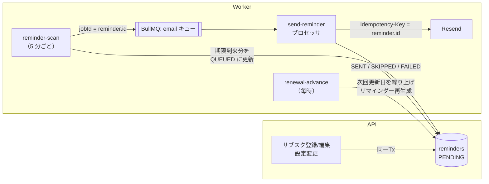
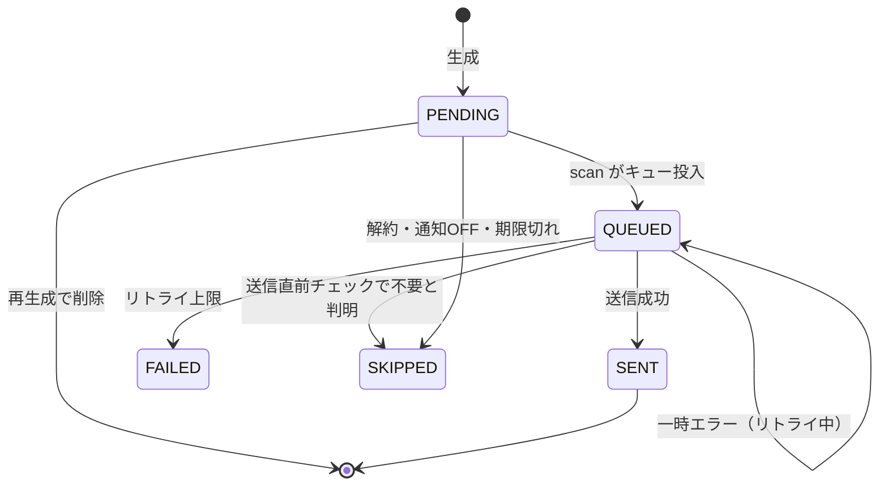
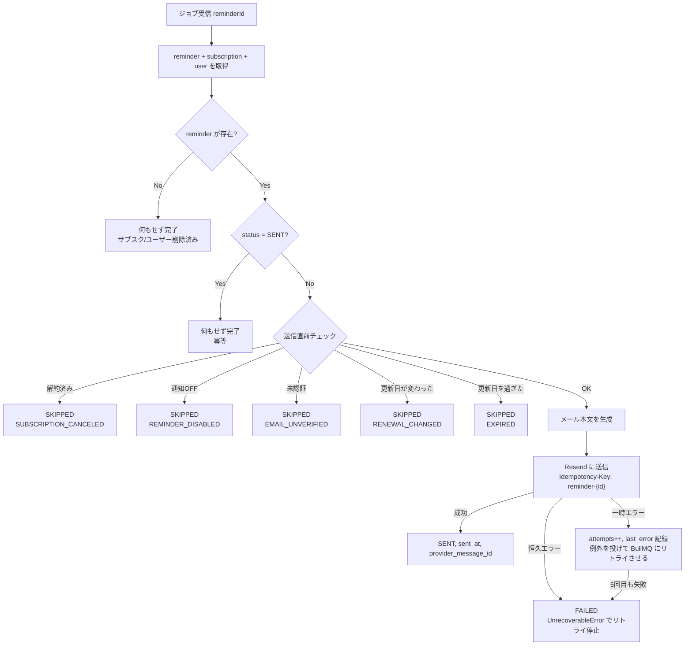

# 07. 更新リマインダー・非同期ジョブ設計（主役）

本アプリの中核。**「送るべき通知を、送るべき時に、ちょうど 1 回だけ送る」** を、
プロセス停止・多重起動・外部 API 障害がある前提で実現する。

## 1. 設計の全体像

### 1.1 基本方針：DB を正、キューは実行手段



- 「いつ・何を送るか」は **`reminders` テーブル** が持つ（アウトボックスパターン）
- キュー（Redis）は「今すぐ送る」ための実行手段にすぎない。Redis のデータが消えても、DB から再構築できる
- 数か月先の通知を遅延ジョブとして Redis に溜めない（ADR-006）

### 1.2 キューとジョブ一覧

| キュー | ジョブ名 | 種類 | 実行タイミング | 役割 |
|---|---|---|---|---|
| `scheduler` | `reminder-scan` | 定期 | 5 分ごと（`*/5 * * * *`） | 送信時刻が来たリマインダーを email キューへ投入 |
| `scheduler` | `renewal-advance` | 定期 | 毎時 0 分 | 更新日を過ぎたサブスクの次回更新日を繰り上げ |
| `scheduler` | `cleanup` | 定期 | 毎日 03:00 UTC | 期限切れセッション・トークン・古い履歴・未認証アカウントの削除 |
| `email` | `send-reminder` | 都度 | scan から投入 | リマインダーメール送信 |
| `email` | `send-auth-email` | 都度 | API から投入 | 認証・リセット・登録済み通知メール送信 |

定期ジョブの登録（worker 起動時。何度呼んでも同じスケジューラが上書きされるだけで重複しない）：

```ts
// 定期ジョブを登録（冪等：同じ ID なら上書き）
await schedulerQueue.upsertJobScheduler('reminder-scan',   { pattern: '*/5 * * * *' }, { name: 'reminder-scan' });
await schedulerQueue.upsertJobScheduler('renewal-advance', { pattern: '0 * * * *' },   { name: 'renewal-advance' });
await schedulerQueue.upsertJobScheduler('cleanup',         { pattern: '0 3 * * *', tz: 'UTC' }, { name: 'cleanup' });
```

> ワーカーを複数台起動しても、BullMQ の Job Scheduler は 1 つの定期ジョブを 1 回だけ発火させる。
> さらにスキャン処理自体も `SKIP LOCKED` で多重実行に耐えるようにする（二重の安全策）。

### 1.3 リマインダーの状態遷移



| 状態 | 意味 | 再生成時に削除されるか |
|---|---|---|
| PENDING | 送信待ち | 削除される |
| QUEUED | キュー投入済み・送信処理中 | 削除しない（送信中の可能性） |
| SENT | 送信済み | 削除しない（**再送防止の証拠**） |
| SKIPPED | 送らないと判断 | 削除しない（履歴） |
| FAILED | リトライしても失敗 | 削除しない（履歴） |

## 2. リマインダーの生成

### 2.1 生成関数（ドメイン層の純粋関数）

```ts
type ReminderPlan = { renewalDate: LocalDate; offsetDays: number; scheduledAt: Date };

// 1 サブスク分の「送るべき通知」を計算する
export function planReminders(params: {
  nextRenewalDate: LocalDate;
  offsets: number[];        // 有効なオフセット（サブスク上書き or ユーザー既定）
  timezone: string;
  notifyHour: number;
  now: Date;
}): ReminderPlan[] {
  const plans = params.offsets.map((offset) => ({
    renewalDate: params.nextRenewalDate,
    offsetDays: offset,
    scheduledAt: toUtc(subDays(params.nextRenewalDate, offset), params.notifyHour, params.timezone),
  }));

  const future = plans.filter((p) => p.scheduledAt > params.now);
  if (future.length > 0) return future;

  // すべて過去だが、更新日がまだ来ていない（当日含む）なら、直近 1 通を即時送信する（穴 B7）
  const renewalEnd = endOfLocalDay(params.nextRenewalDate, params.timezone);
  if (params.now < renewalEnd && plans.length > 0) {
    const nearest = plans.reduce((a, b) => (a.offsetDays < b.offsetDays ? a : b));
    return [{ ...nearest, scheduledAt: params.now }];
  }
  return [];
}
```

### 2.2 生成条件

以下をすべて満たすときだけ生成する：
- ユーザーがメール認証済み（`email_verified_at IS NOT NULL`）
- ユーザーの `reminder_enabled = true`
- サブスクの `status = ACTIVE` かつ `reminder_enabled = true`

### 2.3 再生成（`regenerateReminders(tx, subscriptionId)`）

**必ず呼び出し元と同じトランザクション内** で実行する。

```ts
async function regenerateReminders(tx: Prisma.TransactionClient, subscriptionId: string, now: Date) {
  // 1. 未送信（PENDING）を削除
  await tx.reminder.deleteMany({ where: { subscriptionId, status: 'PENDING' } });

  // 2. 条件を満たさなければ生成しない
  const sub = await tx.subscription.findUniqueOrThrow({ where: { id: subscriptionId }, include: { user: true } });
  if (!shouldGenerate(sub)) return;

  // 3. 計画を作成し INSERT。既に同じ (subscription_id, renewal_date, offset_days) が
  //    SENT / QUEUED / SKIPPED / FAILED で存在する場合は ON CONFLICT で無視 → 再送しない
  const plans = planReminders({ ... });
  await tx.reminder.createMany({
    data: plans.map((p) => ({ subscriptionId, userId: sub.userId, ...p })),
    skipDuplicates: true, // = ON CONFLICT DO NOTHING
  });
}
```

### 2.4 再生成のトリガー

| イベント | 対象 | 発生場所 |
|---|---|---|
| サブスク登録 | 当該サブスク | API |
| サブスク編集（日付・周期・通知設定） | 当該サブスク | API |
| 再開（reactivate） | 当該サブスク | API |
| 解約 | 当該サブスクの PENDING を SKIPPED に更新（生成しない） | API |
| 次回更新日の繰り上げ | 当該サブスク | Worker（renewal-advance） |
| メール認証完了 | ユーザーの全 ACTIVE サブスク | API |
| 設定変更（TZ・通知時刻・既定オフセット・全体 ON/OFF） | ユーザーの全 ACTIVE サブスク | API |
| 配信停止リンク | ユーザーの PENDING を SKIPPED に更新 | API |

> 最大 200 件 × 3 オフセット = 600 行程度なので、ユーザー単位の再生成も API 内の同期処理で十分速い。

## 3. ジョブ詳細

### 3.1 reminder-scan（5 分ごと）

```sql
-- ① 送信時刻が来た PENDING を取得して QUEUED に変更（複数ワーカーが同時に走っても行を奪い合わない）
WITH due AS (
  SELECT id FROM reminders
  WHERE status = 'PENDING' AND scheduled_at <= now()
  ORDER BY scheduled_at
  LIMIT 500
  FOR UPDATE SKIP LOCKED
)
UPDATE reminders r
SET status = 'QUEUED', queued_at = now(), updated_at = now()
FROM due WHERE r.id = due.id
RETURNING r.id;
```

```ts
// ② 取得した ID をキューへ投入。jobId を reminder.id にすることで同じ ID のジョブは二重に入らない
await emailQueue.addBulk(ids.map((id) => ({
  name: 'send-reminder',
  data: { reminderId: id },
  opts: { jobId: `reminder-${id}`, attempts: 5, backoff: { type: 'exponential', delay: 60_000 } },
})));
```

```sql
-- ③ 取り残し回収：QUEUED のまま 30 分以上経過したものを再投入対象にする
--    （①の UPDATE 後、②の前にプロセスが落ちた場合の救済。BullMQ には原子性がないため必要 → ADR-002）
SELECT id FROM reminders
WHERE status = 'QUEUED' AND queued_at < now() - interval '30 minutes'
LIMIT 500;
-- → 同じ jobId で addBulk。キューに既に存在（リトライ待ち等）なら BullMQ が無視するので安全
```

- 1 回 500 件ずつ、取得件数が 500 なら同じジョブ内でループ（最大 10 周）
- **15 分以内に投入** の非機能要件：5 分間隔スキャンで最悪 5 分＋処理時間で満たす

### 3.2 send-reminder（email キュー）



送信直前チェックの詳細：

| チェック | 条件 | 理由 |
|---|---|---|
| 解約済み | `subscription.status != ACTIVE` | キュー投入後に解約された |
| 通知 OFF | `user.reminder_enabled = false` または `subscription.reminder_enabled = false` | 同上 |
| 未認証 | `user.email_verified_at IS NULL` | 念のため |
| 更新日変更 | `reminder.renewal_date != subscription.next_renewal_date` | 投入後に編集された（新しい日付の行は別途生成済み） |
| 期限切れ | 現在時刻が `renewal_date` の終わり（ユーザー TZ）を過ぎている | 停止からの復旧時に古い通知を送らない（穴 B6） |

エラー分類：

| 種別 | 例 | 扱い |
|---|---|---|
| 一時エラー | ネットワーク断、タイムアウト、HTTP 429、5xx | リトライ（1 分→2 分→4 分→8 分→16 分） |
| 恒久エラー | HTTP 400/422（不正なアドレス等）、401/403（API キー不正） | 即 FAILED（401/403 は設定ミスなのでエラーログを ERROR レベルで出す） |

FAILED への更新は、プロセッサ内で「最終試行（`job.attemptsMade + 1 >= job.opts.attempts`）で失敗した」ときに行う。
`worker.on('failed')` イベントだけに頼ると、イベント処理中にプロセスが落ちた場合に QUEUED のまま残るため、③の取り残し回収と組み合わせる。

### 3.3 renewal-advance（毎時）

ユーザーごとにタイムゾーンが違うため、**毎時** 「ユーザーのローカル日付で更新日を過ぎたもの」を探す。

```sql
SELECT s.id
FROM subscriptions s
JOIN users u ON u.id = s.user_id
WHERE s.status = 'ACTIVE'
  AND s.next_renewal_date < (now() AT TIME ZONE u.timezone)::date
LIMIT 500
FOR UPDATE OF s SKIP LOCKED;
```

各サブスクについて同一トランザクションで：
1. `next_renewal_date = nextRenewalDate(anchor, cycleMonths, todayInUserTz)`
2. `is_trial` が true なら false に
3. 旧更新日の PENDING リマインダー（通常は存在しない）を `SKIPPED(EXPIRED)`
4. `regenerateReminders()`

- 何度実行しても結果が同じ（冪等）：既に繰り上がっていれば WHERE 条件に該当しない
- 長期停止後でも `nextRenewalDate()` が一気に正しいサイクルまで進める

### 3.4 cleanup（日次）

| 対象 | 条件 |
|---|---|
| sessions | `expires_at < now()` または `absolute_expires_at < now()` |
| auth_tokens | `expires_at < now() - 7 days` または `used_at < now() - 7 days` |
| reminders | `status IN (SENT, SKIPPED, FAILED)` かつ `updated_at < now() - 1 year` |
| users | 未認証・作成 7 日以上・サブスク 0 件 |

### 3.5 send-auth-email（email キュー）

- API がトランザクションをコミットした **後** にキューへ投入
- 投入失敗（Redis 停止）時は API は 202 を返しつつエラーログ。ユーザーは「再送」で回復できるため、アウトボックスまでは作らない（割り切り）
- `jobId` は `auth-{authTokenId}`、Idempotency-Key も同じ
- attempts 3、指数バックオフ 30 秒

## 4. 冪等性（重複送信防止）のまとめ

| 層 | 仕組み | 防ぐもの |
|---|---|---|
| ① DB | `UNIQUE(subscription_id, renewal_date, offset_days)` ＋ `skipDuplicates` | 同じ通知行が 2 つできる（再生成・編集の繰り返し） |
| ② DB | `FOR UPDATE SKIP LOCKED` ＋ `PENDING→QUEUED` の状態遷移 | 複数ワーカーのスキャンが同じ行を拾う |
| ③ キュー | `jobId = reminder-{id}` | 同じリマインダーのジョブが 2 つ入る（取り残し回収との競合） |
| ④ ワーカー | 処理開始時に `status = SENT` なら即完了 | リトライ・再投入されたジョブの二重処理 |
| ⑤ メール API | `Idempotency-Key: reminder-{id}` | 「送信成功 → DB を SENT に更新する前にクラッシュ」→ リトライで再送 |

### 残るリスク（明示的に許容）

- ⑤の冪等キーには保持期間がある（Resend は 24 時間）。それを超えてから再試行されるケースは、③の 30 分回収と最大リトライ 31 分の範囲ではまず発生しない
- 結果として「**最大 1 回（at-most-once）に限りなく近い、少なくとも 1 回（at-least-once）**」の配信保証となる。これが外部 API 連携における現実的な落とし所であることを設計判断として記録する

## 5. メール仕様

### 5.1 リマインダーメール

| 項目 | 内容 |
|---|---|
| From | `サブスク管理 <noreply@{送信ドメイン}>`（SPF・DKIM・DMARC を設定） |
| 件名（通常） | `【{N}日後に更新】{サービス名}（{金額}円）` ／ 当日は `【本日更新】...` |
| 件名（トライアル） | `【{N}日後にトライアル終了・課金開始】{サービス名}` |
| 本文 | サービス名、更新日（曜日付き）、金額、請求サイクル、解約ページ URL（あれば）、メモ、アプリの詳細画面リンク |
| フッター | 配信停止リンク、通知設定画面リンク |
| ヘッダー | `List-Unsubscribe: <https://{APP_URL}/api/v1/email/unsubscribe?token=...>`、`List-Unsubscribe-Post: List-Unsubscribe=One-Click` |
| 形式 | HTML ＋ テキスト（マルチパート） |

- サービス名は件名用に改行除去・50 文字で切り詰め
- 金額・日付は送信時点の DB の値を使う（キュー投入後に名前・金額を編集しても最新が反映される）

### 5.2 認証系メール

| 種類 | 件名 |
|---|---|
| メール認証 | 【サブスク管理】メールアドレスの確認 |
| 既に登録済み | 【サブスク管理】このメールアドレスは登録済みです |
| パスワードリセット | 【サブスク管理】パスワード再設定のご案内 |

## 6. ワーカーの運用設計

| 項目 | 設定 |
|---|---|
| 並列数 | email キュー concurrency 5、scheduler キュー concurrency 1 |
| 送信レート | Resend の上限（無料枠は秒間リクエスト数に制限あり）に合わせ BullMQ の `limiter: { max: 2, duration: 1000 }` |
| ジョブ保持 | 完了ジョブは 24 時間 / 1000 件、失敗ジョブは 7 日保持（`removeOnComplete` / `removeOnFail`）→ Redis 肥大化防止 |
| ロック | `lockDuration` 60 秒（メール送信のタイムアウト 15 秒より十分長く） |
| 停止 | SIGTERM で `worker.close()` を待ってから終了（処理中ジョブを完了させる）。PaaS の停止猶予時間内に収める |
| Redis 接続 | `maxRetriesPerRequest: null`（BullMQ Worker の要件） |
| 時刻注入 | `now` を引数で受け取る設計にし、テストで時刻を固定できるようにする |

## 7. 監視・可視化

- ログ：各ジョブの開始・終了・件数・所要時間を JSON ログに出力（`jobName`, `jobId`, `reminderId`）
- Bull Board：開発環境では `/admin/queues` で有効。本番は環境変数 `ENABLE_BULL_BOARD=false` 既定（有効時は Basic 認証必須）
- 異常検知（簡易）：scan ジョブ実行時に「`scheduled_at` から 1 時間以上 PENDING / QUEUED のままの件数」をログに WARN 出力

## 8. pg-boss を採用した場合の差分（比較用）

| 箇所 | BullMQ（採用） | pg-boss |
|---|---|---|
| scan の①②の原子性 | 別々（取り残し回収③が必要） | `UPDATE` と `boss.send()` を同一トランザクションにでき、③不要 |
| 重複投入防止 | `jobId` | `singletonKey: reminderId` |
| 定期ジョブ | `upsertJobScheduler` | `boss.schedule('reminder-scan', '*/5 * * * *')` |
| レート制限（API） | Redis を流用 | 別途 Postgres ベースのストアが必要 |
| インフラ | Postgres ＋ Redis | Postgres のみ |
