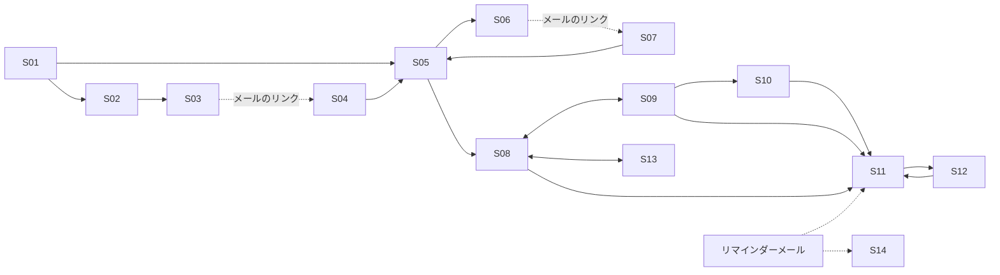

# 08. 画面設計

## 1. 画面一覧

| ID | パス | 画面 | 認証 |
|---|---|---|---|
| S01 | `/` | トップ（ログイン済みなら `/dashboard` へリダイレクト） | − |
| S02 | `/signup` | サインアップ | − |
| S03 | `/signup/sent` | 確認メール送信完了 | − |
| S04 | `/verify-email` | メール認証（`#token` を読み取りボタンで確定） | − |
| S05 | `/login` | ログイン（`?next=` 対応） | − |
| S06 | `/forgot-password` | パスワードリセット申請 | − |
| S07 | `/reset-password` | 新パスワード設定（`#token`） | − |
| S08 | `/dashboard` | ダッシュボード（可視化） | ○ |
| S09 | `/subscriptions` | サブスク一覧 | ○ |
| S10 | `/subscriptions/new` | サブスク登録 | ○ |
| S11 | `/subscriptions/[id]` | サブスク詳細（通知履歴含む） | ○ |
| S12 | `/subscriptions/[id]/edit` | サブスク編集 | ○ |
| S13 | `/settings` | 設定（通知・タイムゾーン・パスワード変更・退会） | ○ |
| S14 | `/unsubscribe` | 配信停止（`?token=`。ボタンで確定） | − |
| S15 | `not-found` / `error` | 404 / エラー画面 | − |

## 2. 画面遷移



## 3. 共通レイアウト（ログイン後）

```
┌──────────────────────────────────────────────┐
│ サブスク管理   ダッシュボード  一覧  設定   [ログアウト] │
├──────────────────────────────────────────────┤
│ ⚠ メールアドレスが未確認です。確認すると更新通知が届きます [再送] │ ← 未認証時のみ
├──────────────────────────────────────────────┤
│                 （各画面）                       │
└──────────────────────────────────────────────┘
```
スマホ幅ではナビをハンバーガーメニュー化。

## 4. 各画面の詳細

### S08 ダッシュボード

```
┌─────────────┬─────────────┬─────────────┐
│ 月額換算合計  │ 年額換算合計  │ 契約中        │
│ ¥9,820       │ ¥117,840     │ 8件（試用1）  │
└─────────────┴─────────────┴─────────────┘
 ※年額サブスクは12で割った概算です

┌ 今後30日の更新 ─────────────────────────┐
│ 10/12(月) あと7日  Netflix        ¥1,590  │
│ 10/20(火) あと15日 Adobe [試用中]  ¥7,780  │
└────────────────────────────────────────┘

┌ サービス別（月額換算）──┐ ┌ 支払いサイクル別 ───┐
│ ■■■■■■■ Adobe          │ │   （円グラフ）       │
│ ■■■■ Netflix           │ │  月払い 75%         │
│ ■■ Spotify             │ │  年払い 25%         │
└───────────────────────┘ └──────────────────┘
```

- データ：`GET /dashboard/summary`
- 棒グラフは上位 10 件＋「その他」にまとめる（件数が多いと読めないため）
- 0 件時：空状態の説明と「最初のサブスクを登録」ボタン
- 「あと N 日」が 3 日以内は強調色、トライアルはバッジ表示

### S09 一覧

- タブ：契約中 / 解約済み / すべて（`?status=` と同期）
- 並び替え：次回更新日・金額・月額換算・名前
- 各行：名前、金額＋サイクル（例「¥1,590 / 月」「¥12,000 / 年」「¥3,000 / 3か月」）、次回更新日、通知アイコン（ON/OFF）、トライアルバッジ
- 行クリックで詳細へ
- フィルタ・ソートは URL クエリに保持（リロード・共有で状態維持）

### S10 / S12 登録・編集フォーム

| 項目 | UI | 補足 |
|---|---|---|
| サービス名 | テキスト | |
| 金額 | 数値（円） | 全角数字も半角に変換 |
| 請求サイクル | 「毎月 / 毎年 / カスタム」ラジオ。カスタムで「[N] [か月/年] ごと」 | |
| 初回請求日 | 日付ピッカー | ラベル「初回請求日（トライアル中ならトライアル終了日）」 |
| 無料トライアル中 | チェックボックス | ON でラベル変化 |
| 次回更新日プレビュー | 表示のみ | 入力に応じてクライアント側で計算して表示（共有パッケージの domain 関数を利用） |
| 通知 | トグル | |
| 通知タイミング | 「既定（7日前・1日前）を使う」/「個別に設定」＋チップ選択（0〜30） | 最大 3 つ |
| 解約ページ URL | URL | |
| メモ | テキストエリア | 残り文字数表示 |

- バリデーションは共有 zod スキーマ（フロントとサーバーで同一）。サーバーの 422 の `errors[]` を各フィールドに表示
- 送信中はボタン無効化（二重送信防止）
- 編集画面で未保存のまま離脱しようとしたら確認ダイアログ

### S11 詳細

- 全項目表示＋「次回更新日まであと N 日」
- 操作：編集 / 解約済みにする（確認ダイアログ）/ 再開 / 削除（確認ダイアログに「解約済みにする」との違いを明記）
- 通知履歴：`GET /subscriptions/{id}/reminders`（日時・何日前・状態）
- 解約ページ URL は外部リンクとして表示

### S13 設定

| セクション | 内容 |
|---|---|
| 通知 | 全体 ON/OFF、通知時刻（0〜23 時）、既定の通知タイミング（チップ選択） |
| タイムゾーン | セレクト（検索可）。初期値はサインアップ時のブラウザ TZ |
| アカウント | メールアドレス（表示のみ）、認証状態、パスワード変更 |
| 危険な操作 | 退会（パスワード入力＋確認ダイアログ） |

## 5. 状態管理・データ取得

| 項目 | 方針 |
|---|---|
| サーバー状態 | TanStack Query（`['me']`, `['subscriptions', filters]`, `['subscription', id]`, `['dashboard']`） |
| 更新後 | ミューテーション成功時に関連クエリを invalidate（例：サブスク編集 → 一覧・詳細・ダッシュボード） |
| クライアント状態 | フォームは React Hook Form、それ以外はほぼ不要（グローバルストアは導入しない） |
| レンダリング | ログイン後画面はクライアントコンポーネント中心（TanStack Query で取得）。公開画面は Server Component |
| API クライアント | `fetch` の薄いラッパー。Problem Details を型付きエラーに変換。`credentials: 'same-origin'` |
| 日付表示 | API の `YYYY-MM-DD` はそのまま「ローカル日付」として扱い、`new Date()` で TZ 変換しない（ずれ防止） |

## 6. アクセシビリティ・UX

- フォームは `<label>` 関連付け、エラーは `aria-describedby` で読み上げ
- グラフには数値の表（またはテキスト）を併記
- 色だけで状態を表さない（「あと 3 日」の強調はアイコン＋色）
- 成功・失敗はトースト通知
- ローディングはスケルトン表示
